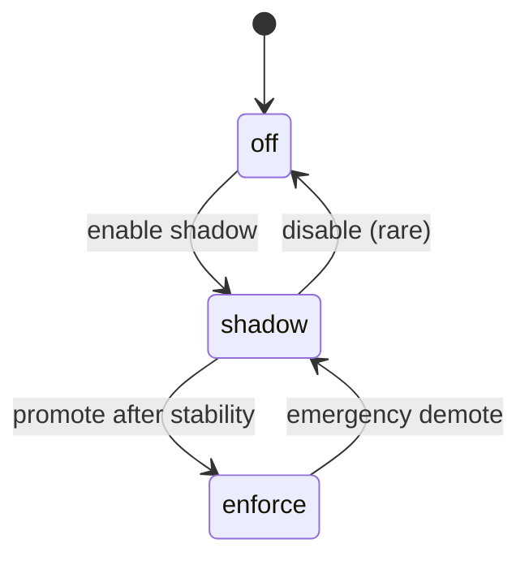

# Feature Flags Specification (Phase A-D)

| Flag | States | Purpose | Dependencies | Rollout Plan | Metrics Guard | Rollback Trigger |
|------|--------|---------|--------------|--------------|---------------|------------------|
| allocation_dual_write | off, shadow, enforce | Introduce ledger writes safely | payment_allocations table | off→shadow (N days)→enforce | drift_ppm, write_error_rate | drift_ppm > 500 or write_errors >1% |
| ledger_backfill_mode | off, read_only, active | Prevent new alloc mut during backfill | dual_write=shadow | off→read_only→active→off | backfill_progress %, synthetic_completeness | completeness < 100% after timeout |
| allocation_read_switch | off, canary, full | Switch read path to ledger/cache | invoice_balance_cache | off→canary(5%)→25%→full | drift_ppm stable ~0 | drift_ppm > threshold twice |
| active_reconciliation | off, dry, enforce | Auto-correct detected drift | reconciliation_runs | off→dry→enforce | repair_success_rate | repair_fail_ratio > 5% |
| allocation_runtime_guards | off, warn, enforce | Enforce invariants (I1,I2,I6,I7) early during partial allocations | allocation_partial_mode!=off | off→warn→enforce | guard_violation_rate | violation_rate spike > threshold |
| allocation_partial_mode | off, allow, enforce | Enable partial allocation shadow & later authoritative | dual_write≥shadow | off→allow→enforce | drift_ppm, partial_success_rate | drift_ppm > threshold or anomalies |
| usage_line_visibility | off, on | Expose allocation/usage lines for audit | partial_mode allow+ | off→on | api_latency, lines_fetch_error_rate | latency > SLA or error_rate high |
| outbox_enabled | off, on | Reliable telegram/event delivery | outbox table | off→on | delivery_success_rate | success < 99% sustained |
| event_stream_enabled | off, shadow, full | Persist domain events for replay | financial_events table | off→shadow→full | replay_accuracy | replay_accuracy < 99.9% |

## State Transitions


## Metrics Definitions
- drift_ppm = ((|Σledger - Σlegacy|) / Σlegacy) * 1e6
- write_error_rate = failed_ledger_writes / total_ledger_writes
- synthetic_completeness = synthetic_lines / legacy_allocations_count
- replay_accuracy = 1 - (|debt_replay - debt_ground| / debt_ground)

## Operational Policies
1. Each promotion requires 3 consecutive green reconciliation_runs.
2. Canary scope selection deterministic hash(representative_id) % 100 < percentage.
3. Emergency demote sets featureFlagManager log with reason code.

## Logging Template
```json
{
  "flag": "allocation_dual_write",
  "from": "shadow",
  "to": "enforce",
  "timestamp": "ISO",
  "actor": "admin_user",
  "metrics": {
    "drift_ppm": 0,
    "write_error_rate": 0
  },
  "justification": "3 green cycles"
}
```

## Future Considerations
- Potential addition: partial_allocation_ui flag if decoupled (اگر UI مستقل نیاز rollout مجزا داشت).
- event_stream_enabled gating export & analytics.
- potential guard escalation logic (auto promote warn→enforce after N clean batches).
