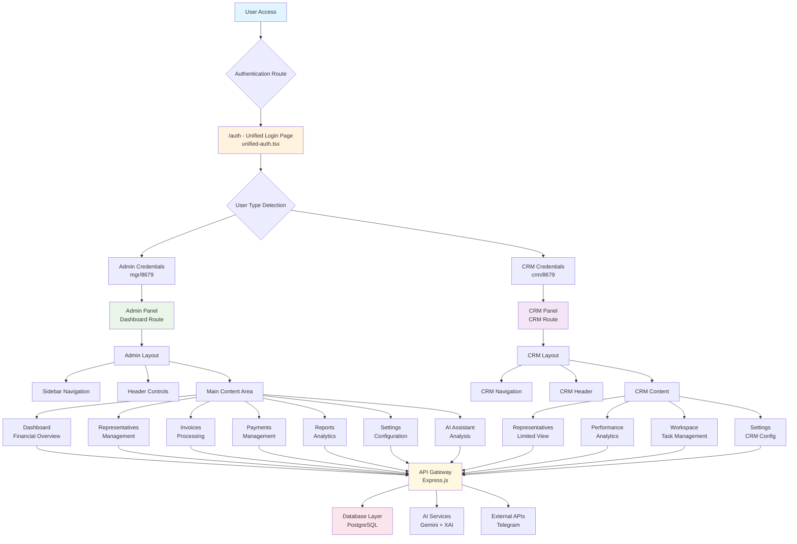
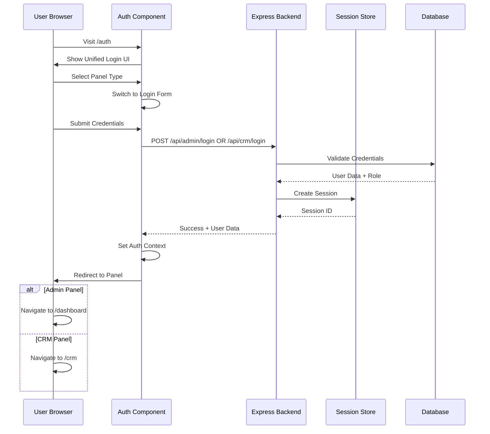
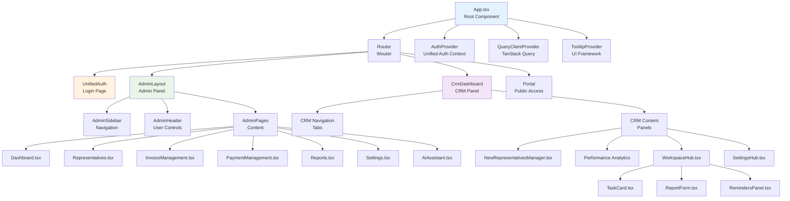
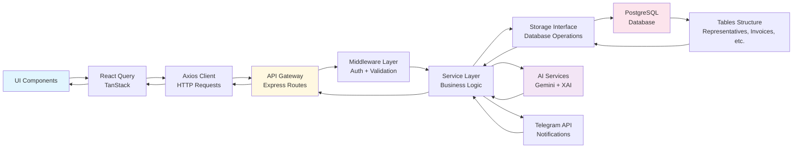
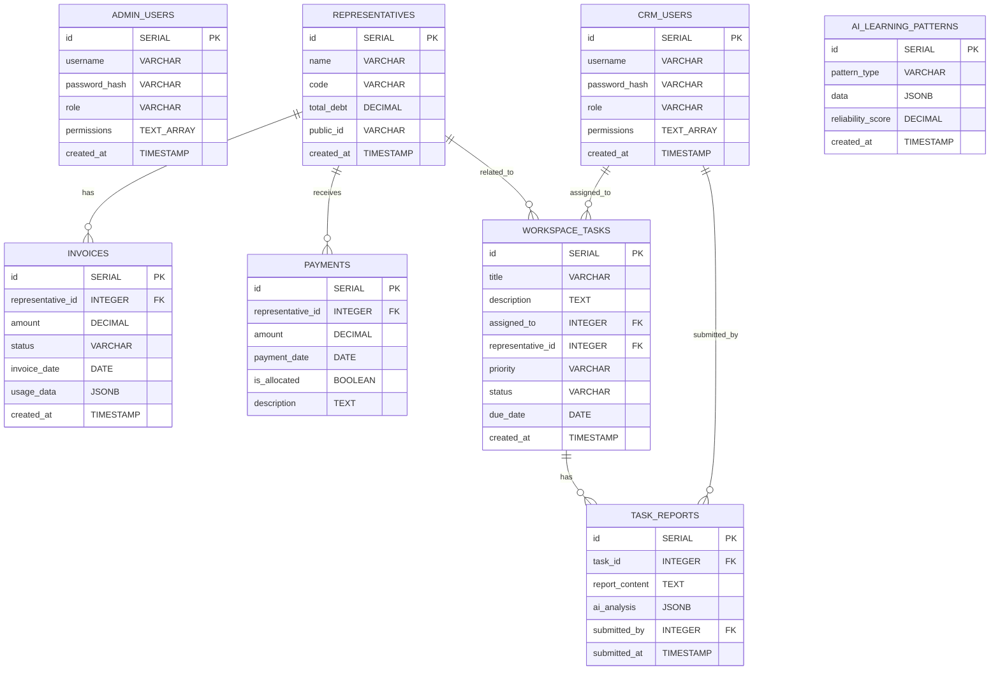
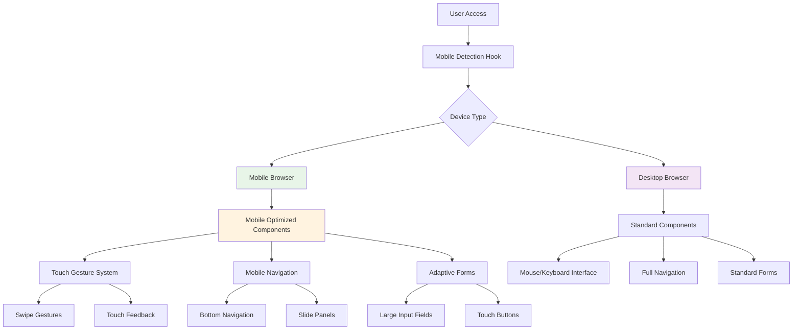
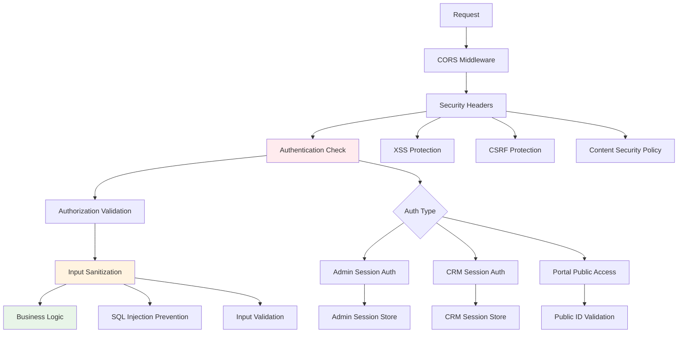

# 🏗️ نمودار معماری کامل سیستم MarFaNet

## 📊 معماری کلی سیستم



## 🔐 Authentication Flow Diagram



## 🏛️ Component Architecture Hierarchy



## 🔄 Data Flow Architecture



## 🗃️ Database Schema Architecture



## 🛣️ Routing Architecture

```mermaid
graph TB
    %% Root Routes
    A[/ Root] --> B[/auth Unified Login]
    A --> C[/dashboard Admin Panel]
    A --> D[/crm CRM Panel]
    A --> E[/portal/:publicId Public Portal]
    
    %% Admin Panel Routes
    C --> F[/dashboard Main Dashboard]
    C --> G[/representatives Management]
    C --> H[/invoices Processing]
    C --> I[/payments Management]
    C --> J[/sales-partners Partners]
    C --> K[/reports Analytics]
    C --> L[/settings Configuration]
    C --> M[/ai-assistant AI Tools]
    C --> N[/financial-integrity Audit]
    
    %% CRM Panel Routes (Internal Tabs)
    D --> O[Representatives Tab]
    D --> P[Performance Tab]
    D --> Q[Workspace Tab]
    D --> R[Settings Tab]
    
    %% API Routes
    A --> S[/api/* Backend APIs]
    S --> T[/api/admin/* Admin APIs]
    S --> U[/api/crm/* CRM APIs]
    S --> V[/api/portal/* Portal APIs]
    
    %% Admin API Endpoints
    T --> W[/api/admin/login]
    T --> X[/api/admin/representatives]
    T --> Y[/api/admin/invoices]
    T --> Z[/api/admin/payments]
    
    %% CRM API Endpoints
    U --> AA[/api/crm/login]
    U --> BB[/api/crm/representatives]
    U --> CC[/api/crm/tasks]
    U --> DD[/api/crm/reports]
    
    style B fill:#fff3e0
    style C fill:#e8f5e8
    style D fill:#f3e5f5
    style E fill:#e1f5fe
    style S fill:#fff8e1
```

## 🔧 Service Layer Architecture

```mermaid
graph TB
    %% Core Services
    A[Service Layer] --> B[Authentication Services]
    A --> C[Financial Services]
    A --> D[CRM Services]
    A --> E[AI Services]
    A --> F[Integration Services]
    
    %% Authentication
    B --> G[Admin Auth Service]
    B --> H[CRM Auth Service]
    B --> I[Session Management]
    
    %% Financial
    C --> J[Invoice Processing Engine]
    C --> K[Payment Management]
    C --> L[Debt Calculation]
    C --> M[Financial Integrity]
    
    %% CRM
    D --> N[Task Management]
    D --> O[Report Analysis]
    D --> P[Performance Analytics]
    D --> Q[Workspace Storage]
    
    %% AI
    E --> R[XAI Grok Engine]
    E --> S[Gemini AI Service]
    E --> T[Persian AI Engine]
    E --> U[Learning Patterns]
    
    %% Integrations
    F --> V[Telegram Service]
    F --> W[Storage Interface]
    F --> X[Health Monitoring]
    
    style A fill:#e3f2fd
    style C fill:#e8f5e8
    style D fill:#f3e5f5
    style E fill:#fff3e0
```



## 📱 Mobile Optimization Architecture



## 🔐 Security Architecture



---

## 📋 خلاصه معماری

### 🎯 **نقاط ورودی:**
- `/auth` - صفحه ورود یکپارچه
- `/dashboard` - پنل مدیریت
- `/crm` - پنل CRM
- `/portal/:publicId` - پرتال عمومی

### 🔐 **سیستم احراز هویت:**
- **Admin**: `mgr/8679` یا `admin/8679`
- **CRM**: `crm/8679`
- **Portal**: دسترسی عمومی بدون احراز هویت

### 🏗️ **لایه‌های اصلی:**
1. **Frontend**: React + TypeScript + TanStack Query
2. **API Gateway**: Express.js + Middleware
3. **Service Layer**: Business Logic + AI Integration  
4. **Data Layer**: PostgreSQL + Drizzle ORM

### 🤖 **خدمات هوشمند:**
- **XAI Grok Engine**: تحلیل و تولید محتوا
- **Gemini AI**: تحلیل مالی و پیشنهادات
- **Persian AI Engine**: پردازش متن فارسی

### 📱 **بهینه‌سازی موبایل:**
- تشخیص خودکار دستگاه
- رابط کاربری انطباقی  
- حرکات لمسی بهینه شده
- فرم‌های موبایل دوستدار
